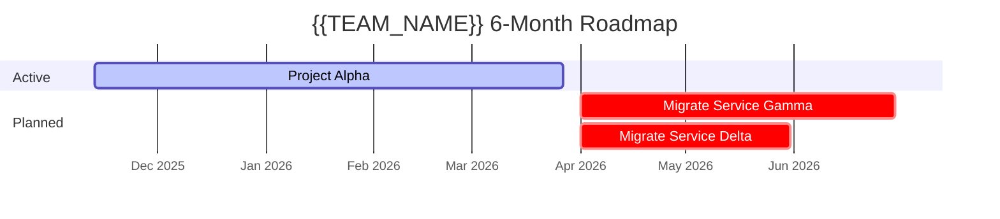
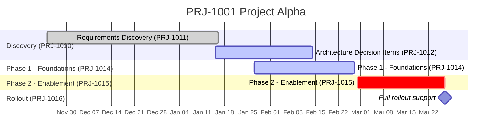

# Timeline Sync Templates

## Full Output Structure

```markdown
# Project Timeline

Synced from Jira. Last synced: [MMM DD, YYYY HH:MM]

---

## Legend

- **Gantt status markers**: `:done` = Done/Merged | `:active` = In Progress/Developing/Peer Review | `:crit` = Backlog/To Do
- **Source of truth**: All dates, statuses, and assignees come directly from Jira

---

## 6-Month Roadmap

[View 2 Gantt here]

### Unscheduled Projects

[Unscheduled table here]

---

## Active Project Details

[View 1 sections here — one per active project]
```

---

## View 3: Visual Roadmap Table (Confluence — MANDATORY)

This visual roadmap table **MUST** be included whenever syncing the Project Timeline to Confluence. It provides a month-column grid with `██` block indicators showing when each project is active. This is the primary visual at the top of the Confluence page.

### Template

```markdown
### Visual Timeline ([Start Month] [Year] – [End Month] [Year])

| Project | [Mon1] | [Mon2] | [Mon3] | [Mon4] | [Mon5] | [Mon6] | [Mon7] | [Mon8] | [Mon9] | [Mon10] | [Mon11] |
|---------|--------|--------|--------|--------|--------|--------|--------|--------|--------|---------|---------|
| **[Project Name]** ([KEY]) — [Status] | [██ or empty] | ... | | | | | | | | | |
```

### Rules for View 3

1. **Month columns**: Start from the current month and extend through the end of the roadmap (typically 10–12 months)
2. **██ indicators**: Place `██` in each month column where the project is active (based on its start/end dates from Jira)
3. **Project name format**: `**[Short Name]** ([KEY]) — [Status]`
4. **Statuses**: Append the Jira status after the ticket key (e.g., "Delivering", "Planned")
5. **Empty cells**: Leave cells blank for months where the project is not active
6. **Month calculation**: A project is active in a month if any part of its date range overlaps with that month
7. **Placement**: This table goes **immediately after** the `## 6-Month Roadmap` heading, **before** the Project Details table

### Example

```markdown
### Visual Timeline (Feb 2026 – Dec 2026)

| Project | Feb | Mar | Apr | May | Jun | Jul | Aug | Sep | Oct | Nov | Dec |
|---------|-----|-----|-----|-----|-----|-----|-----|-----|-----|-----|-----|
| **Project Alpha** (PRJ-1001) — Delivering | ██ | ██ | | | | | | | | | |
| **Project Beta** (PRJ-1002) — Planned | | | ██ | ██ | | | | | | | |
| **Project Gamma** (PRJ-1003) — Planned | | | | | ██ | ██ | | | | | |
| **Project Delta** (PRJ-1004) — Planned | | | | | | | ██ | ██ | | | |
| **Project Epsilon** (PRJ-1005) — Planned | | | | | | | | | ██ | ██ | |
```

---

## View 2: 6-Month Roadmap Gantt Template

```mermaid
gantt
    title {{TEAM_NAME}} 6-Month Roadmap
    dateFormat YYYY-MM-DD
    axisFormat %b %Y

    section Active
    [Project Name 1] :[status], [id], [start], [end]
    [Project Name 2] :[status], [id], [start], [end]

    section Planned
    [Planned Project 1] :[status], [id], [start], [end]
    [Planned Project 2] :[status], [id], [start], [end]
```

### Example



### Rules for View 2

- **Active projects**: Use `:active` or `:done` based on Jira project ticket status
- **Planned projects with dates**: Use `:crit` (not started)
- **Planned projects without dates**: Exclude from Gantt, list in Unscheduled table instead
- **Date source**: Jira project ticket dates; fallback to min(created)/max(duedate) from epics
- **Time window**: Today through today + 6 months

---

## Unscheduled Projects Table Template

```markdown
### Unscheduled Projects

| Project | Jira Ticket | Impact | Notes |
|---------|-------------|--------|-------|
| [Project Name] | [[KEY]](https://{{ATLASSIAN_SITE}}/browse/[KEY]) | [Impact from all-projects.md if available] | No dates in Jira |
```

### Example

```markdown
### Unscheduled Projects

| Project | Jira Ticket | Impact | Notes |
|---------|-------------|--------|-------|
| Migrate authorization layer | [PRJ-1017](https://{{ATLASSIAN_SITE}}/browse/PRJ-1017) | Unified authorization | Large — needs to be done in stages |
| Rotate signing keys | [PRJ-1018](https://{{ATLASSIAN_SITE}}/browse/PRJ-1018) | Security risk reduction | Small-Medium |
```

---

## View 1: Detailed Active Project Template

### Project Section

```markdown
### [Project Name] ([KEY]) — [Status from Jira]

- **Jira**: [[KEY] - [Name]](https://{{ATLASSIAN_SITE}}/browse/[KEY])
- **Confluence**: [URL if exists]

[Detailed Gantt chart]

[Ticket Summary Table]

---
```

### Detailed Gantt Template

```mermaid
gantt
    title [KEY] [Project Name]
    dateFormat YYYY-MM-DD
    axisFormat %b %d

    section [Milestone 1 Name] ([MILESTONE-KEY])
    [Epic Name] ([EPIC-KEY]) :[status], [id], [start], [end]
    [Epic Name] ([EPIC-KEY]) :[status], [id], [start], [end]

    section [Milestone 2 Name] ([MILESTONE-KEY])
    [Epic Name] ([EPIC-KEY]) :[status], [id], [start], [end]
```

### Example



### Gantt Status Mapping

| Jira Status | Gantt Marker | Description |
|-------------|-------------|-------------|
| `Done` | `:done` | Completed |
| `Merged` | `:done` | Completed (code merged) |
| `In Progress` | `:active` | Currently being worked on |
| `Developing` | `:active` | Currently being developed |
| `Peer Review` | `:active` | In review |
| `Backlog` | `:crit` | Not yet started |
| `To Do` | `:crit` | Not yet started |

### Date Handling

| Scenario | Start Date | End Date |
|----------|-----------|----------|
| Both dates in Jira | Use Jira start date | Use Jira due date |
| Only due date | Use created date as start | Use Jira due date |
| Only start date | Use Jira start date | Flag as missing — use end of quarter as placeholder |
| No dates at all | Use created date | Flag as missing — use end of quarter as placeholder |

---

## Ticket Summary Table Template

```markdown
| Ticket | Summary | Status | Due | Assignee |
|--------|---------|--------|-----|----------|
| **[Milestone Name]** |||||
| [[MILESTONE-KEY]](https://{{ATLASSIAN_SITE}}/browse/[MILESTONE-KEY]) | [Summary] | [Status] | [Due] | [Assignee or —] |
| **Epics** |||||
| [[EPIC-KEY]](https://{{ATLASSIAN_SITE}}/browse/[EPIC-KEY]) | [Summary] | [Status] | [Due] | [Assignee or —] |
```

### Example

```markdown
| Ticket | Summary | Status | Due | Assignee |
|--------|---------|--------|-----|----------|
| **Discovery Milestone** |||||
| [PRJ-1010](https://{{ATLASSIAN_SITE}}/browse/PRJ-1010) | Discovery | In Progress | Jan 16, 2026 | [assignee] |
| **Epics** |||||
| [PRJ-1011](https://{{ATLASSIAN_SITE}}/browse/PRJ-1011) | Requirements Discovery | In Progress | Jan 16, 2026 | [assignee] |
| [PRJ-1012](https://{{ATLASSIAN_SITE}}/browse/PRJ-1012) | Architecture Decision Items | To Do | — | — |
| **Implementation Milestone** |||||
| [PRJ-1013](https://{{ATLASSIAN_SITE}}/browse/PRJ-1013) | Implementation | Backlog | Mar 27, 2026 | — |
| **Epics** |||||
| [PRJ-1014](https://{{ATLASSIAN_SITE}}/browse/PRJ-1014) | Phase 1 - Foundations | Backlog | Feb 27, 2026 | — |
| [PRJ-1015](https://{{ATLASSIAN_SITE}}/browse/PRJ-1015) | Phase 2 - Enablement | Backlog | Mar 27, 2026 | — |
| **Rollout Milestone** |||||
| [PRJ-1016](https://{{ATLASSIAN_SITE}}/browse/PRJ-1016) | Rollout | Backlog | — | — |
```

---

## JQL Queries Used

### Get all non-done projects (primary source of truth)
```
project = {{JIRA_PROJECT_KEY}} AND issuetype = Project AND statusCategory != Done ORDER BY status ASC, created DESC
```

### Get milestones for a project
```
parent = [PROJECT-KEY] ORDER BY created ASC
```

### Get epics for a milestone
```
parent = [MILESTONE-KEY] ORDER BY created ASC
```

### Jira fields to request
```
summary, status, assignee, duedate, created, resolutiondate, {{TARGET_START_FIELD}}, {{TARGET_END_FIELD}}
```

- `{{TARGET_START_FIELD}}` = "Target start" (preferred start date) — resolve from shared/config.md
- `{{TARGET_END_FIELD}}` = "Target end" (preferred end date, used alongside `duedate`) — resolve from shared/config.md

---

## Sync Summary Template (shown to user before writing)

```markdown
## Timeline Sync Summary

**Active projects synced:** [N]
**Backlog projects checked:** [N]
**Total tickets queried:** [N]

### Tickets with missing dates
- [KEY] - [Summary] (no due date)
- [KEY] - [Summary] (no start date or due date)

### Tickets that could not be fetched
- [KEY] — [error message]

### Changes detected
- [KEY]: Status changed [Old] → [New]
- [KEY]: Due date changed [Old] → [New]
- [KEY]: New ticket not in previous timeline

Approve to write project-timeline.md? (yes/no)
```
